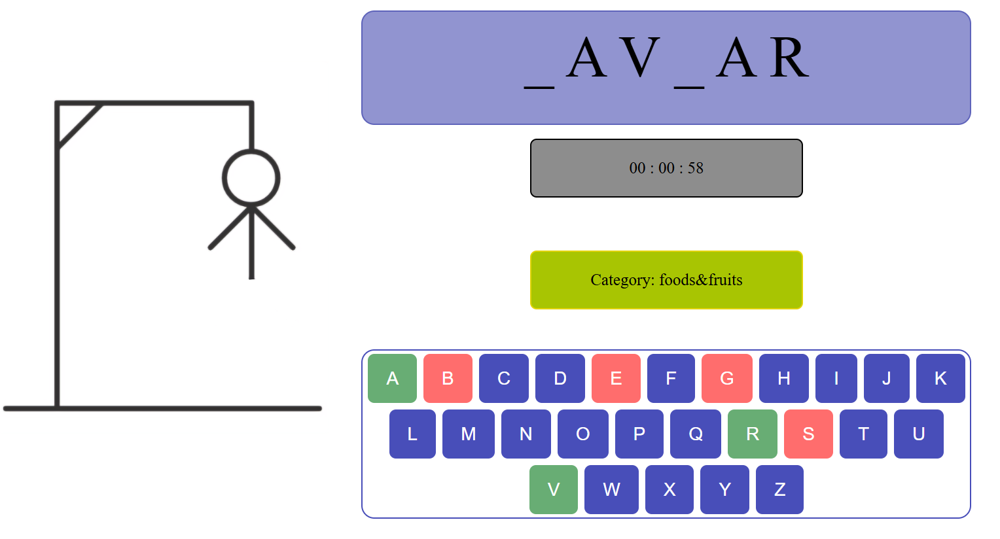

# Hangman Game with Django
<p float="center">
  
  
</p>

# Introduction
Welcome to the Hangman Game, a classic word guessing game implemented using the Django framework. Also the frontend of this application is created using basic HTML, CSS, and JavaScript, integrated into Django templates.

# Installation
Follow these steps to set up the project locally:

1. Clone the repository
```bash
git clone [https://github.com/yourusername/hangman-django.git](https://github.com/AmirAzade/HangMan.git)
```
2. Open directory
```bash
cd HangMan
```
3. Install the dependencies
```bash
pip install -r requirements.txt
```
4. Apply migrations
```bash
python manage.py migrate
```
5. Run the development server
```bash
python manage.py runserver
```
6. Open your web browser and go to http://127.0.0.1:8000/ and enjoy the game!

# Live Demo
You can try out the live version of the Hangman Game from <a href = "https://amirazade.ir/hangman">Here</a>
